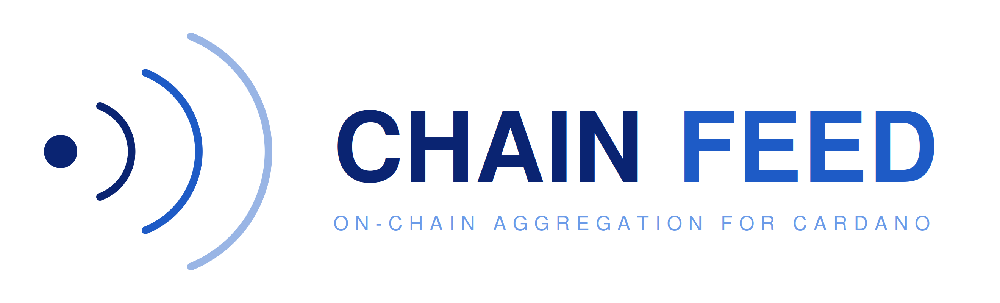

# CHAINFEED


> Cardano stable-coin oracle aggregator with x402 payment settlement,
> on-chain reserves attestation, and offline-verifiable audit packs.
>
> Built as a CAP service on top of [ODATANO](https://github.com/ODATANO/ODATANO).

> 🚧 Hackathon project — under active development.

---

## What

AI agents and modern businesses need fresh, **verifiable** data. CHAINFEED
indexes every Cardano-native stablecoin (USDM, DJED, iUSD, USDA, USDCx)
with multi-source price aggregation, on-chain reserves attestation, and
per-quote audit-trail. Consumers pay via [x402](https://www.x402.org)
micropayments in USDM — no API keys, no accounts.

The differentiation is **trust-by-construction**: every quote ships with
its on-chain provenance (Cardano tx hashes, datum-decoding source code,
hash-sealed off-chain artifacts where relevant) so a consumer who
distrusts CHAINFEED can re-verify the answer end-to-end.

## Coverage

### Stable taxonomy

5 USD-pegged Cardano stables in `srv/lib/stable-metadata.ts`:

| Symbol | Backing | Issuer | Reserves source |
|---|---|---|---|
| **USDM** | fiat-custodial | Mehen | on-chain attestation (Charli3 ODV) — `USDM-RESERVES` |
| **DJED** | overcollateralized-ada | Coti | on-chain reserve script — `DJED-RESERVES` |
| **iUSD** | overcollateralized-cdp | Indigo Protocol | on-chain CDP aggregate — `iUSD-COLLATERAL` |
| **USDA** | fiat-custodial | Anzens / EMURGO (BitGo Trust) | gap — Anzens publishes no public attestation today |
| **USDCx** | fiat-custodial | Circle (via IOG xReserve) | off-chain Circle PDF (hash-sealed) — `USDCx-ATTESTATION` |

Wanchain-bridged USDT/USDC are out of scope — no liquid direct DEX pool
backs them today (all pools < 1k ADA TVL). Re-add when liquidity returns.

### Price pairs (`POST /getBestPrice`)

All pairs now sourced via direct DEX reads — no aggregator routing.

| Pair | Sources | Notes |
|---|---|---|
| ADA-USD     | orcfax + charli3 + minswap | multi-source median |
| ADA-USDM    | orcfax + charli3 + sundae + minswap-v2 + wingriders | 5 sources; Charli3 inverts on-chain USDM/ADA |
| ADA-USDA    | minswap-v2 + wingriders | both 4.5M-ADA CONSTANT_PRODUCT pools |
| ADA-DJED    | orcfax + minswap-v2 + wingriders | direct constant-product, Coti policy disambiguates DJED vs SHEN |
| ADA-iUSD    | orcfax + minswap-v2 + wingriders | Indigo policy disambiguates iUSD vs iBTC/iETH/iSOL |
| ADA-USDCx   | sundae + minswap-v2 | |
| BTC-ADA     | charli3 (mainnet) | single-source — confidence capped at 0.5 |
| BTC-USD     | charli3 (preprod) | single-source — confidence capped at 0.5 |
| NIGHT-ADA   | charli3 + sundae + wingriders V2 | multi-source, math-cross-verified < 0.4% |

### Reserves / attestation pairs (`AttestationQuote`, never enters price aggregation)

| Pair | Source | Unit | Adapter |
|---|---|---|---|
| USDM-RESERVES    | Charli3 ODV (Mehen Proof-of-Reserve) | `usd` | `srv/adapters/charli3.ts` |
| DJED-RESERVES    | Coti Djed reserve script (UTxO-aggregate) | `ratio_pct` | `srv/adapters/djed-reserves.ts` |
| iUSD-COLLATERAL  | Indigo CDP-manager UTxO-aggregate | `ratio_pct` | `srv/adapters/indigo-cdp.ts` |
| iBTC/iETH/iSOL-COLLATERAL | same Indigo CDP source | `synthetic_debt` | `srv/adapters/indigo-cdp.ts` |
| USDCx-ATTESTATION | Circle's monthly USDC examination PDF (sha256-sealed) | `attestation-binary` | `srv/adapters/circle-usdc-attestation.ts` |

### Stable-stable cross-rates

`srv/adapters/wingriders-stableswap.ts` reads WingRiders V2 STABLESWAP
pools (USDM ↔ DJED, USDM ↔ USDA, USDM ↔ iUSD, DJED ↔ iUSD) for
cross-stable convergence-checking. **Reports pool reserve-ratios, not
exact STABLESWAP spot** — Curve-amplification is in the pool datum, not
GraphQL — so use for pool-imbalance monitoring, not trade pricing.
Decoding the pool datum for true Curve spot is a future sprint item.

## Endpoints

All paid endpoints are gated by x402 USDM payment. All free endpoints
are exempt from x402.

### Paid (x402-gated)

| Endpoint | Price (raw) | Returns |
|---|---|---|
| `GET /Prices` | 10 000 (0.01 USDM) | Aggregated price history (paginated OData) |
| `GET /Sources` | 10 000 (0.01 USDM) | Per-source audit rows (price, txHash, source) |
| `POST /getBestPrice` | 10 000 (0.01 USDM) | Multi-source aggregated price + `pegDeviationBps` for stables |
| `POST /getStableHealth` | (gating TBD) | Composite per-stable: price + reserves + supply + liquidity-depth + risk-score + alerts |
| `POST /getOhlcv` | (gating TBD) | 1m/5m/15m/1h/4h/1d candles from `AggregatedPrices` history |
| `POST /getAuditPack` | (gating TBD) | Self-contained JSON envelope, per-file sha256, on-chain tx-hashes — verifiable offline against any Cardano node |
| `POST /getServiceStatus` | (free) | Per-adapter cache age + last-error — for ops dashboards |
| `POST /getArbitrageOpportunities` | 50 000 (0.05 USDM) | Best-buy / best-sell DEX, spread%, profitable flag |
| `POST /getTWAP` | 20 000 (0.02 USDM) | Time-weighted average over a window from history |

### Subscriptions (peg-break webhook alerts)

x402-gated, per-subscription pricing scales with threshold + duration —
see `srv/x402/verify-confirmed.ts:priceForSubscription`. Examples:
24h at 5% threshold = 0.74 USDM, 30d at 0.1% = 360 USDM.

| Endpoint | Returns |
|---|---|
| `POST /subscribePegAlert` | `{subscriptionId, hmacSecretHex}` (secret returned ONCE — persist immediately) |
| `POST /listSubscriptions` | All subscriptions for an `ownerAddr` |
| `POST /cancelSubscription` | Cancel by id with ownership check |

The peg-monitor worker (`srv/workers/peg-monitor.ts`, started separately
from the CAP server) polls active subscriptions every 60s, fires
HMAC-signed POSTs at threshold-cross with 15-min cooldown +
0.5×-threshold rearm hysteresis. Webhook signing scheme: HMAC-SHA256
over `${timestamp}.${body}`, headers `X-Chainfeed-Signature` +
`X-Chainfeed-Timestamp`. Replay defense: recipients verify timestamp
delta < 5 min.

### Free

- `GET /odata/v4/price/$metadata` — OData schema

### Wire surface

- HTTP 402 + `accepts[]` body wire-compatible with the
  [Masumi `scheme_exact_cardano` spec](https://github.com/masumi-network/x402-cardano/blob/main/specs/schemes/exact/scheme_exact_cardano.md).
- `X-PAYMENT` header → base64 JSON wrapping a base64 CBOR signed Cardano tx.
- `X-PAYMENT-RESPONSE` header on success → base64 JSON `{success, network, transaction}`.
- Replay protection at two layers: in-process nonce table
  (`X402PaymentNonces`, UNIQUE PK on tx hash) and on-chain double-spend
  rejection by Cardano itself.

## Architecture

```
                                        ┌──────────────────────────────────────────┐
┌──────────┐ 402 + paymentRequirements  │              CHAINFEED (CAP)             │
│  Buyer   │ ◄──────────────────────────│                                          │
│ (Lace,   │                            │  ┌────────────────────────────────────┐  │
│  agent,  │ X-PAYMENT (signed CBOR)    │  │  srv/middleware/x402.ts            │  │
│  bot…)   │ ─────────────────────────► │  │   decode → validate → settle ──────┼──┼─► Cardano
└──────────┘                            │  │   → claim nonce → audit            │  │  via ODATANO
                                        │  └─────────────┬──────────────────────┘  │  bridge (1.7.6+)
                                        │                │ next()                  │
                                        │  ┌─────────────▼──────────────────────┐  │
                                        │  │  PriceService (price-service.ts)   │  │
                                        │  │   getBestPrice / pegDeviationBps   │  │
                                        │  │   getStableHealth / getOhlcv       │  │
                                        │  │   getAuditPack / getServiceStatus  │  │
                                        │  │   subscribePegAlert / list / cancel│  │
                                        │  │   getTWAP / getArbitrageOpps       │  │
                                        │  └─┬──────────────┬───────────────────┘  │
                                        │    │              │                      │
                                        │ ┌──▼──────────┐ ┌─▼───────────────────┐  │
                                        │ │ aggregation │ │ adapters/registry   │  │
                                        │ │  median/conf│ │   ┌── orcfax────────┼──┼─► Cardano (Orcfax FS UTxO)
                                        │ │  +1-src cap │ │   ├── charli3───────┼──┼─► Cardano (Charli3 OracleFeed/C3AS)
                                        │ │  pegDevBps  │ │   ├── minswap───────┼──┼─► api-mainnet-prod.minswap.org
                                        │ │  twap/devPct│ │   ├── minswap-v2────┼──┼─► Koios credential_utxos (paginated)
                                        │ └─────────────┘ │   ├── sundaeswap────┼──┼─► api.sundae.fi/graphql
                                        │                 │   ├── wingriders────┼──┼─► api.mainnet.wingriders.com
                                        │ ┌─────────────┐ │   ├── wingriders-   │  │
                                        │ │ srv/lib/    │ │   │   stableswap────┼──┼─► same (STABLESWAP pools)
                                        │ │  stable-    │ │   ├── djed-reserves─┼──┼─► bridge.getUtxosAtAddress
                                        │ │  health     │ │   │                 │  │     + bridge.getAssetInfo
                                        │ │  risk-score │ │   ├── indigo-cdp────┼──┼─► bridge.getUtxosAtCredential
                                        │ │  liquidity- │ │   │                 │  │     (Koios, ODATANO 1.7.6)
                                        │ │  depth      │ │   └── circle-usdc-  │  │
                                        │ │  audit-pack │ │       attestation───┼──┼─► circle.com/transparency
                                        │ │  signing    │ │                     │  │     (PDF hash-sealed)
                                        │ │  metadata   │ └─────────┬───────────┘  │
                                        │ │             │           │ withCache()  │
                                        │ └─────────────┘   ┌───────▼───────────┐  │
                                        │                   │ srv/lib/cache.ts  │  │
                                        │                   │ stale-while-      │  │
                                        │                   │ revalidate, dedup │  │
                                        │                   │ + status() probe  │  │
                                        │                   └───────────────────┘  │
                                        └──────────────────────────────────────────┘

         ┌──────────────────────────────┐
         │  srv/workers/peg-monitor.ts  │  separate process, 60s poll loop,
         │  ──────────────────────────  │  fires HMAC-signed POSTs at peg-break
         │  AlertSubscriptions table    │  with 15-min cooldown + rearm hysteresis
         └──────────────────────────────┘
```

## Stack

- **CAP** ([SAP Cloud Application Programming Model](https://cap.cloud.sap))
  provides the OData V4 + REST surface, the CDS data model, and the
  Express middleware integration point.

- **ODATANO** ([@odatano/core](https://www.npmjs.com/package/@odatano/core)
  v1.7.6+) is the Cardano integration layer — Blockfrost / Koios /
  Ogmios with circuit-breaker failover, request coalescing, and CSL
  bindings. CHAINFEED uses ODATANO's *programmatic* API
  (`getCardanoClient` + `getUtxosAtCredential` + `getAssetInfo` +
  inline-datum auto-population) rather than its CDS services. The
  feedback loop that produced 1.7.6's new APIs is documented in
  [`docs/odatano-feedback.md`](docs/odatano-feedback.md).

- **x402** is implemented in-process — no external facilitator. Two
  payment paths:
  - *Header-based pre-settle* (`srv/x402/process.ts`) for one-shot
    `/getBestPrice`-style calls.
  - *Post-confirmed-tx-hash* (`srv/x402/verify-confirmed.ts`) for
    subscriptions and any pre-paid grant.

  Wire-compatible with the Masumi spec for forward swap. ADR:
  [`docs/adr/0001-x402-impl.md`](docs/adr/0001-x402-impl.md).

- **Aggregation** is pure-functional —
  `median(values)` for the central price,
  `confidence(values)` from coefficient-of-variation,
  `deviationPct(values)` as max-min spread,
  `pegDeviationBps(adaStablePrice, adaUsdPrice)` as `(adaUsdPrice/adaStablePrice − 1) × 10⁴`,
  `twap(samples, start, end)` with per-sample weighting,
  `bucketSamples` for OHLCV.

- **Risk score** (`srv/lib/stable-risk-score.ts`) is a weighted composite
  of pegConfidence (0.45) + reserveAdequacy (0.30) +
  attestationFreshness (0.15) + sourceConfidence (0.10), with
  per-component transparency in the response so consumers can compute
  their own weights.

- **Audit packs** (`srv/lib/audit-pack.ts`) are self-contained JSON
  envelopes — never a binary ZIP — with per-file sha256 checksums and
  on-chain tx-hashes. The README inside every pack documents the
  consumer-side verification recipe (no CHAINFEED-specific tooling
  needed; just sha256 + a Cardano indexer).

- **Response signing** (`srv/lib/response-signing.ts`) is optional
  end-to-end provenance via Ed25519 — extends the audit-pack guarantee
  past CHAINFEED's HTTP boundary so downstream aggregators can forward
  signed quotes without trust loss. Native `node:crypto`, no external
  dep.

- **Cache** (`srv/lib/cache.ts`) is internal (no `node-cache` dep),
  stale-while-revalidate with in-flight Promise dedup so a hot pair
  never produces concurrent upstream calls. Exposes a `status()` probe
  for ops introspection (per-pair age, last-error).

## Tests

376/376 unit + integration tests passing across 24 test files.
HTTP-only smoke suite runs in ~13s in parallel; chain-dependent smokes
run sequentially with `BLOCKFROST_API_KEY` env. Full Cardano-stable
adapter coverage:

```bash
npm run typecheck          # tsc --noEmit
npm run check-no-js        # TS-only file policy
npm run smoke              # all live smokes
                           # SKIP_CHAIN_SMOKES=1 / SKIP_HTTP_SMOKES=1 to scope
```

Per-file test counts in [`CLAUDE.md`](CLAUDE.md#testing).

## Live e2e proofs (preprod)

| Action | Tx hash |
|---|---|
| Faucet → wallet | `6b9a421d9cc0117ad71c2bab0b9d9a8d4078de06ae5bd93a7146352a1eca9070` |
| Mock-USDM mint  | `06ca13439891f77d4f4b0a8cc94073e3cd25cf83cd8c8e1e5c824651dfb1b7a6` |
| Paid `/Prices` read | `b03860882b8259561c64c0e2317ca3373be6b4e7ba0c9890df29d51ed7e17001` |
| Paid `/getBestPrice` (2 sources) | `d56478b6109b902cef5e0629a2e317fbfc478994daf4dcb4d5571288152bffab` |
| Paid `/getArbitrageOpportunities` | `193146c744014768381ca6473b0793cc40fe9e3fe28adbdee55f144b2fe0b01b` |

## Coming soon

A marketplace where any wallet can register its own feed and earn USDM
directly from each consumer call (90/10 split, no contracts, no API
keys, no accounts). Plus Pyth Cardano integration when their Lazer
mainnet ships, gold (XAU) feeds when published on-chain, and Ogmios
streaming-driven webhook alerts when ODATANO ships P5.

## License

Apache-2.0 — see [`LICENSE`](LICENSE)
