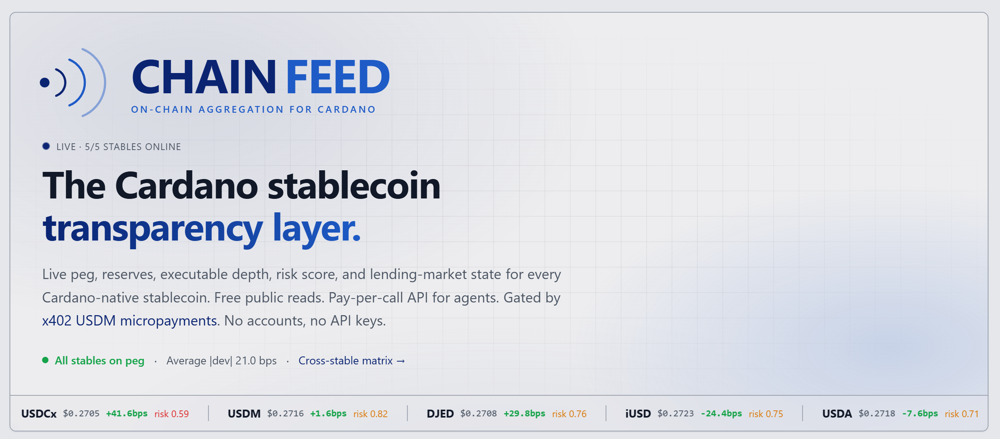

# CHAINFEED



> Cardano stablecoin aggregator with x402 payment settlement,
> on-chain reserves attestation, and offline-verifiable audit packs.
>
> Built as a CAP service on top of [ODATANO](https://github.com/ODATANO/ODATANO).

> 🚧 Hackathon project. Under active development.

---

## What

AI agents and modern businesses need fresh, **verifiable** data. CHAINFEED indexes every Cardano-native stablecoin (USDM, DJED, iUSD, USDA, USDCx) with multi-source price aggregation, on-chain reserves attestation, lending-market state, and per-quote audit-trail. Consumers pay via [x402](https://www.x402.org) micropayments in USDM — no API keys, no accounts.

The differentiation is **trust-by-construction**: every quote ships with its on-chain provenance (Cardano tx hashes, datum-decoding source code, hash-sealed off-chain artifacts where relevant) so a consumer who distrusts CHAINFEED can re-verify the answer end-to-end.

## API

Full endpoint reference: **[`docs/API.md`](docs/API.md)**.

Quick taste:

```bash
curl -X POST https://chainfeed.io/odata/v4/price/getBestPrice \
  -H "Content-Type: application/json" \
  -d '{"pair":"ADA-USDM"}'
```

Free reads (stable health, OHLCV, lending markets, service status). Paid reads gated by x402 USDM (price queries 0.01, audit packs 0.05). Webhook subscriptions for peg-break alerts.

## Coverage

### Stables (`srv/lib/stable-metadata.ts`)

| Symbol | Backing | Issuer | Reserves source |
|---|---|---|---|
| **USDM** | fiat-custodial | Mehen | Charli3 ODV — `USDM-RESERVES` |
| **DJED** | overcollateralized-ada | Coti | on-chain reserve script — `DJED-RESERVES` |
| **iUSD** | overcollateralized-cdp | Indigo Protocol | CDP-manager aggregate — `iUSD-COLLATERAL` |
| **USDA** | fiat-custodial | Anzens / EMURGO (BitGo Trust) | gap — no public attestation today |
| **USDCx** | fiat-custodial | Circle (via IOG xReserve) | hash-sealed Circle PDF — `USDCx-ATTESTATION` |

Wanchain-bridged USDT/USDC are out of scope (no liquid direct DEX pool today).

### Price pairs

| Pair | Sources |
|---|---|
| ADA-USD     | orcfax + charli3 + minswap |
| ADA-USDM    | orcfax + charli3 + sundae + minswap-v2 + wingriders |
| ADA-USDA    | minswap-v2 + wingriders |
| ADA-DJED    | orcfax + minswap-v2 + wingriders |
| ADA-iUSD    | orcfax + minswap-v2 + wingriders |
| ADA-USDCx   | sundae + minswap-v2 |
| BTC-ADA     | charli3 (mainnet, single-source — confidence capped at 0.5) |
| BTC-USD     | charli3 (preprod, single-source) |
| NIGHT-ADA   | charli3 + sundae + wingriders |

### Lending markets

- **FluidTokens v3** — pools, loans, per-asset health, liquidation eligibility (mainnet-only)
- **Liqwid v2** — stable markets (DJED, iUSD, USDM) with on-chain MarketState reads + GraphQL APY

## Architecture

```
                                        ┌──────────────────────────────────────────┐
┌──────────┐ 402 + paymentRequirements  │              CHAINFEED (CAP)             │
│  Buyer   │ ◄──────────────────────────│                                          │
│ (Lace,   │                            │  ┌────────────────────────────────────┐  │
│  agent,  │ X-PAYMENT (signed CBOR)    │  │  srv/middleware/x402.ts            │  │
│  bot…)   │ ─────────────────────────► │  │   decode → validate → settle ──────┼──┼─► Cardano
└──────────┘                            │  │   → claim nonce → audit            │  │  via ODATANO
                                        │  └─────────────┬──────────────────────┘  │
                                        │                │ next()                  │
                                        │  ┌─────────────▼──────────────────────┐  │
                                        │  │  PriceService                      │  │
                                        │  └─┬──────────────┬───────────────────┘  │
                                        │ ┌──▼──────────┐ ┌─▼───────────────────┐  │
                                        │ │ aggregation │ │ adapters/registry   │  │
                                        │ │ median/conf │ │   orcfax · charli3  │  │
                                        │ │ pegDevBps   │ │   minswap{,-v2}     │  │
                                        │ │ twap/ohlcv  │ │   sundae · wingrdrs │  │
                                        │ └─────────────┘ │   djed · indigo     │  │
                                        │                 │   circle · fluid    │  │
                                        │                 │   liqwid            │  │
                                        │                 └─────────┬───────────┘  │
                                        │                           │ withCache()  │
                                        │                   ┌───────▼───────────┐  │
                                        │                   │ stale-while-      │  │
                                        │                   │ revalidate, dedup │  │
                                        │                   └───────────────────┘  │
                                        └──────────────────────────────────────────┘

         ┌──────────────────────────────┐
         │  srv/workers/peg-monitor.ts  │  separate process, 60s poll loop,
         │  AlertSubscriptions table    │  HMAC-signed peg-break webhooks
         └──────────────────────────────┘
```

## Stack

- **CAP:** OData V4 surface, CDS data model, Express middleware integration
- **ODATANO:** ([@odatano/core](https://www.npmjs.com/package/@odatano/core) v1.7.7+) — Cardano integration: Blockfrost / Koios / Ogmios with circuit-breaker failover, request coalescing, CSL bindings
- **x402:** implemented in-process, wire-compatible with Masumi `scheme_exact_cardano`. Two paths: header-based pre-settle, post-confirmed-tx-hash for subscriptions. ADR: [`docs/adr/0001-x402-impl.md`](docs/adr/0001-x402-impl.md)
- **Aggregation:** pure functions: `median`, `confidence`, `deviationPct`, `pegDeviationBps`, `twap`, `bucketSamples`
- **Risk score:** weighted composite (peg 0.45 + reserves 0.30 + freshness 0.15 + sources 0.10) with per-component breakdown in the response
- **Audit packs:** self-contained JSON envelopes with per-file sha256 + on-chain tx hashes; verifiable offline against any Cardano node
- **Response signing:** optional Ed25519 envelope (native `node:crypto`)
- **Cache:** internal stale-while-revalidate, in-flight Promise dedup, `status()` probe for ops

## Tests

```bash
npm run typecheck          # tsc --noEmit
npm run check-no-js        # TS-only file policy
npm run smoke              # all live smokes
                           # SKIP_CHAIN_SMOKES=1 / SKIP_HTTP_SMOKES=1 to scope
```

## Live e2e proofs (preprod)

| Action | Tx hash |
|---|---|
| Faucet → wallet | `6b9a421d9cc0117ad71c2bab0b9d9a8d4078de06ae5bd93a7146352a1eca9070` |
| Mock-USDM mint  | `06ca13439891f77d4f4b0a8cc94073e3cd25cf83cd8c8e1e5c824651dfb1b7a6` |
| Paid `/Prices`  | `b03860882b8259561c64c0e2317ca3373be6b4e7ba0c9890df29d51ed7e17001` |
| Paid `/getBestPrice` | `d56478b6109b902cef5e0629a2e317fbfc478994daf4dcb4d5571288152bffab` |
| Paid `/getArbitrageOpportunities` | `193146c744014768381ca6473b0793cc40fe9e3fe28adbdee55f144b2fe0b01b` |
| Aiken stop_loss script funded (5 tADA + datum) | `38219bdf9c3771f5ee0b0e7a2eb5fd072d1d1cdda141d102f13d524eca8296e6` |
| **Aiken validator consumed CHAINFEED-signed quote on-chain** | `5d7178e9acb63db75f1a40ec466908f066be9a25287f4cf73b2c3e9fc5830b25` |


## License

Apache-2.0 — see [`LICENSE`](LICENSE)
